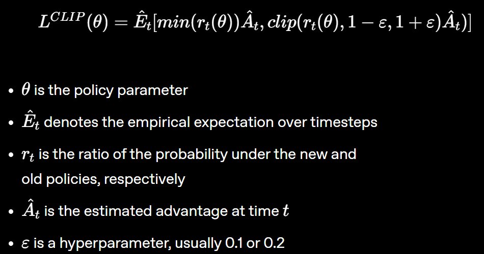

## Video
- ~3 mins
    - HARD MAX 4 mins
- Brief problem description:
    - include images, screenshots, etc
- Before and after training peformance (I can supply the videos for this - Erick)
- Include failure modes
    - Not sure how we'll do this?
    - Maybe talk about models undesirable behaviors
        - Over prioritizing clearing certain lanes
        - Switches somewhat too often (wasted time on yellow)
- Summary of Approach + Future Ideas
    - p.much what we did for our presentation :P

## Project Summary
Traffic patterns change constantly, and the current implementations of turn signals often waste green time while cars pile up elsewhere. These delays add up, and a BestLife Online study reports the average American spends **58.6 hours per year** waiting at red lights. Even small improvements in signal control can therefore save a lot of time across a city.

Most traffic lights today use one of two simple strategies. The first is a **timer-based cycle** that switches on a fixed schedule no matter what is happening on the road. The second uses **basic sensors** that extend or end a phase when a vehicle is detected. This approach helps, but it still struggles with uneven or fast-changing traffic (and can never adapt to light-specific situations) because they rely on rigid rules instead of adapting to the full situation.

Our project, **TrafficIQ**, focuses on adaptive signal control: deciding when to keep a green light or switch it based on what is happening at the intersection right now. This is a hard problem because traffic arrivals are uncertain, the system is only partially observed, and switching has a cost due to yellow clearance time. Reinforcement learning fits well here because it can learn a policy from experience that decreasing average wait time with ensuring no one car waits for too long.

We implemented TrafficIQ in the SUMO simulator for a single 4-way intersection with one lane per direction. The agent observes a compact state vector and chooses between two green directions (North/South vs. East/West). Its goal is to minimize total accumulated waiting time. The learning method is Proximal Policy Optimization (PPO) with an actor-critic neural network trained on simulation rollouts.

Key elements of the system:
- **Environment**: SUMO `Easy_4_Way` map with four approaches (North, South, East, West).
- **State (17-D)**: per-lane halting count, mean speed, occupancy, and waiting time (4 lanes x 4 features = 16) plus current traffic-light phase (1).
- **Action space (2)**: choose the next green direction (North/South vs. East/West). Yellow phases are inserted automatically with a 3-step clearance when switching.
- **Decision cadence**: the agent selects actions every 10 simulation steps.
- **Reward**: shaped to penalize total waiting time and reward reductions in wait from the previous step (`-current_wait + 0.5 * delta_wait`).
- **Model**: PPO actor-critic with two shared 64-unit Tanh layers and separate actor/critic heads, trained for 100 episodes with on-policy updates (4 epochs per episode).

## Evaluation

## Resources Used
**Simulation and control APIs**
- [SUMO User Documentation](https://sumo.dlr.de/docs/index.html) (installation, network setup, and traffic light configuration).
- [TraCI API reference](https://sumo.dlr.de/daily/userdoc/TraCI.html) for online control of SUMO simulations.
- [Interfacing TraCI from Python](https://sumo.dlr.de/docs/TraCI/Interfacing_TraCI_from_Python.html) for the Python client setup and usage patterns.

**ML and scientific computing libraries**
- [PyTorch documentation](https://docs.pytorch.org/docs/stable/index.html) for tensors, neural nets, and optimization utilities used in PPO.
- [NumPy documentation](https://numpy.org/doc/stable/) for array operations and numerical utilities.
- [Matplotlib documentation](https://matplotlib.org/stable/index.html) for generating training curves and sweep plots.

**Algorithms and research references**
- Schulman et al., ["Proximal Policy Optimization Algorithms" (arXiv:1707.06347)](https://arxiv.org/abs/1707.06347).
- Webster, F. V., ["Traffic signal settings" (Road Research Technical Paper No. 39, 1958)](https://trid.trb.org/View/113579).

**Code references and inspiration**
- [AArdaNalbant/Traffic-Signal-Modification-with-Webster-Method](https://github.com/AArdaNalbant/Traffic-Signal-Modification-with-Webster-Method) for the Webster-style baseline structure.
- [Navtegh/Traffic-Light-Management-system-using-RL-and-SUMO](https://github.com/Navtegh/Traffic-Light-Management-system-using-RL-and-SUMO) as a related RL+SUMO reference.

**Motivation, media, and community resources**
- BestLife Online statistic on annual time spent waiting at red lights: ["You'll Spend This Much of Your Life Waiting at Red Lights"](https://bestlifeonline.com/red-lights/).
- [YouTube](https://www.youtube.com/) tutorials for SUMO/RL setup troubleshooting.
- [Stack Overflow](https://stackoverflow.com/) for occasional debugging and environment setup fixes.

**Figures and assets**
- PPO objective graphic adapted from the PPO paper above.
- All other plots and screenshots (training curves, sweep figures, SUMO run captures) were generated from our own experiments.

**AI tool usage (comprehensive)**
- Anthropic Claude: sanity-checking PPO math, generating early template code, and refining report text (including LaTeX equations). Output appears in `ai_traffic_controller_template.py`, `rl_traffic_agent.py`, `run_sim.py`, and the written documentation.
- Google Gemini: cross-checking PPO implementation details, drafting boilerplate for SUMO/TraCI integration, and assisting with wording/clarity edits in documentation.
