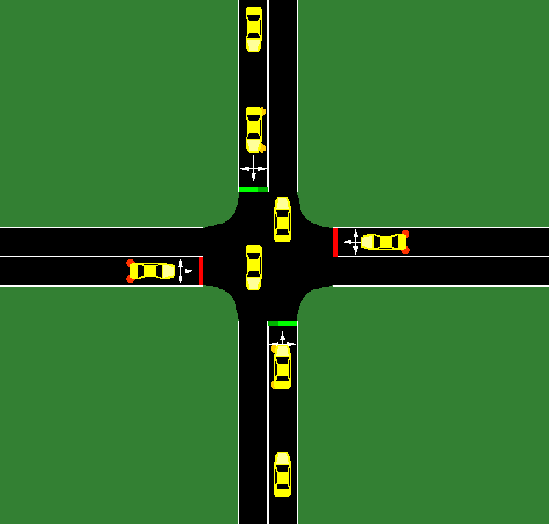
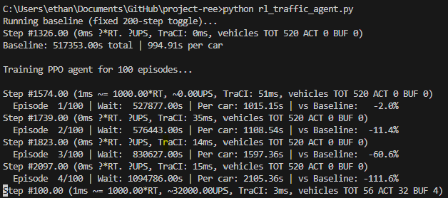
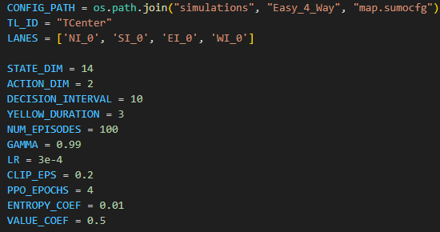
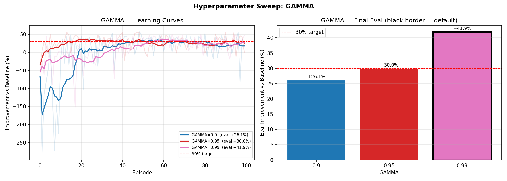
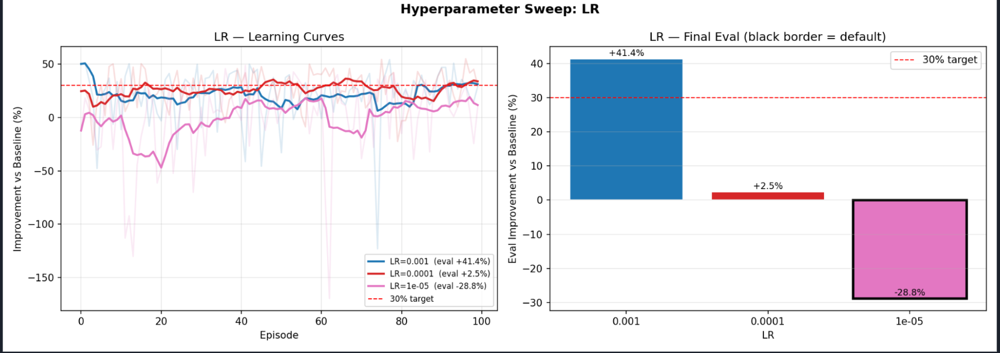
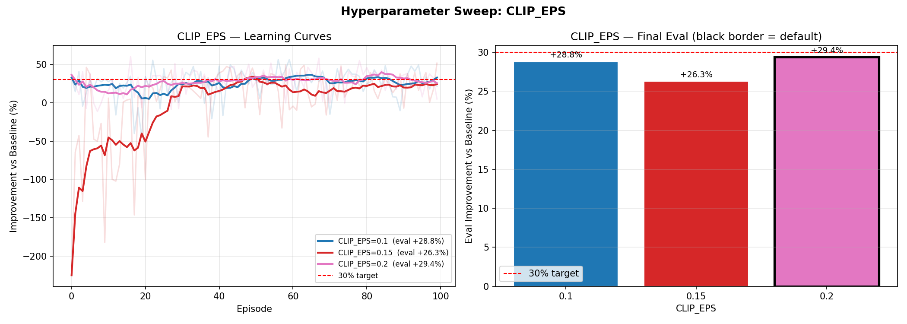
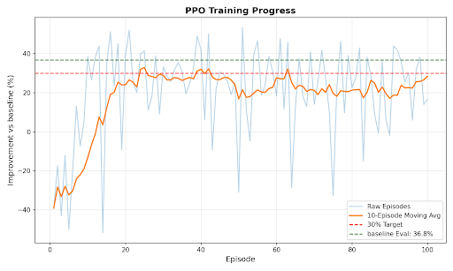

## Video

  <iframe width="560" height="315" src="https://www.youtube.com/watch?v=bgbMiQUB1iU" frameborder="0" allow="accelerometer; autoplay; clipboard-write; encrypted-media; gyroscope; picture-in-picture" allowfullscreen></iframe>

## Project Summary
Traffic patterns change constantly, and the current implementations of turn signals often waste green time while cars pile up elsewhere. These delays add up, and a BestLife Online study reports the average American spends **58.6 hours per year** waiting at red lights. Even small improvements in signal control can therefore save a lot of time across a city.

Most traffic lights today use one of two simple strategies. The first is a **timer-based cycle** that switches on a fixed schedule no matter what is happening on the road. The second uses **basic sensors** that extend or end a phase when a vehicle is detected. This approach helps, but it still struggles with uneven or fast-changing traffic (and can never adapt to light-specific situations) because they rely on rigid rules instead of adapting to the full situation.

Our project, **TrafficIQ**, focuses on adaptive signal control: deciding when to keep a green light or switch it based on what is happening at the intersection right now. This is a hard problem because traffic arrivals are uncertain, the system is only partially observed, and switching has a cost due to yellow clearance time. Reinforcement learning fits well here because it can learn a policy from experience that decreasing average wait time with ensuring no one car waits for too long.

We implemented TrafficIQ in the SUMO simulator for a single 4-way intersection with one lane per direction. The agent observes a compact state vector and chooses between two green directions (North/South vs. East/West). Its goal is to minimize total accumulated waiting time. The learning method is Proximal Policy Optimization (PPO) with an actor-critic neural network trained on simulation rollouts.

Key elements of the system:
- **Environment**: SUMO `Easy_4_Way` map with four approaches (North, South, East, West).
- **State (17-D)**: per-lane halting count, mean speed, occupancy, and waiting time (4 lanes x 4 features = 16) plus current traffic-light phase (1).
- **Action space (2)**: choose the next green direction (North/South vs. East/West). Yellow phases are inserted automatically with a 3-step clearance when switching.
- **Decision cadence**: the agent selects actions every 10 simulation steps.
- **Reward**: shaped to penalize total waiting time and reward reductions in wait from the previous step (`-current_wait + 0.5 * delta_wait`).
- **Model**: PPO actor-critic with two shared 64-unit Tanh layers and separate actor/critic heads, trained for 100 episodes with on-policy updates (4 epochs per episode).

## Evaluation
### Qualitative Results
For qualitative assessment, we evaluated the model against three behavioral criteria:
 
- **Fairness**: All lanes are served within a reasonable time window
- **Stability**: No excessive or rapid phase switching that wastes green time on yellow transitions
- **Adaptivity**: Phase decisions that respond to live traffic conditions rather than following a fixed pattern
 
Throughout development, we validated our model by reviewing recordings of it in action, observing its responses to incoming traffic, current queue state, and active light phase.

<video width="480" height="280" controls>
  <source src="assets/videos/early_agent.mp4" type="video/mp4">
  Your browser does not support the video tag. 
</video>

These reviews surfaced several flaws in our environment setup. First, mean vehicle length proved largely redundant, nearly all vehicles in the simulation share similar dimensions with negligible impact on model behavior. In recognition of this, we removed it from our model's environment variables. Second, earlier iterations showed little awareness of traffic flow, frequently producing stop-and-go light patterns rather than sustained lane clearance.
 
To address this, we introduced **Mean Speed** as an observation feature. The effect was immediate: rather than reacting to static queue snapshots, the agent began prioritizing lane throughput and avoiding unnecessary phase changes. This paired naturally with **Occupancy**, which together provide a dynamic picture of lane congestion that neither variable captures alone.

<video width="480" height="280" controls>
  <source src="assets/videos/webster.mp4" type="video/mp4">
  Your browser does not support the video tag.
</video>

We also cross-validated our model against **Webster's Method**, a more sophisticated adaptive signal control algorithm. Observing its behavior in simulation, we noted strong performance across all three qualitative criteria, especially fairness. It reliably cleared backed-up lanes while remaining responsive to demand on the perpendicular lane. We used this behavior as a reference point and introduced intermediate rewards alongside the **Occupancy** feature, with the goal of steering our model toward the same balance of fairness and attentiveness that Webster's demonstrates.

<video width="480" height="280" controls>
  <source src="assets/videos/agent.mp4" type="video/mp4">
  Your browser does not support the video tag.
</video>

This culminated in our final model seen above. Despite exceeding our initial performance target, we identified two remaining behavioral issues:

- **Lane bias**: The agent places excessive weight on clearing the active lane, sometimes at the expense of the perpendicular approach
- **Phase instability**: The agent switches lights unnecessarily when lanes are lightly occupied

Though we did not have the time to implement formal solutions, we have possible solutions for next steps. To address **lane bias**, we propose a scaling negative reward tied to the occupancy of the perpendicular lane, growing in magnitude as that lane's congestion increases, nudging the agent toward fairness. To combat **phase instability**, a small fixed penalty applied to every yellow phase transition would discourage unnecessary switching without blocking legitimate phase changes.

### Quantitative Results
**All graphs begin at episode 1, they do NOT track random behavior before any training is started**

For quantitative assessment, we evaluated the model against three metrics:
 
- **Average Waiting Time**: The average time, in seconds, a vehicle spent stopped at the intersection
- **Training Convergence**: How consistently the model improved over the course of training
- **Training Variance**: How stable the model's performance was across episodes
 
In earlier iterations, we observed especially high variance between runs. Noisy policy-destabilizing behavior that produced wildly inconsistent final evaluations. To address this, we conducted a sweep over key hyperparameters.
 

 
First, we targeted **Gamma** — a parameter controlling how much the agent weighs future rewards relative to immediate ones. A value of 0.9 was discarded early due to a large initial performance deficit, higher variance, and weaker final results. Values of 0.95 and 0.99 were broadly comparable, with 0.99 earning the edge through both lower training variance and a better final evaluated waiting time.
 

 
Second, we targeted **Learning Rate** — the step size of each gradient descent update. A value of 1e-5 was an immediate outlier, exhibiting excessive training variance and poor final performance. Values of 1e-4 and 1e-3 showed similar convergence behavior and variance, but diverged meaningfully in final evaluated waiting time. Given its superior final performance, 1e-3 was selected.
 

 
Finally, we evaluated **Clip Epsilon**. This parameter, unique to PPO,controls the maximum allowable policy change per update. Performance across tested values was largely comparable across all three metrics, and we opted to retain the standard default of 0.2 common to most PPO implementations.

With hyperparameters settled, we turned to reward shaping to further improve training convergence. We experimented with intermediate rewards, differential fairness penalties, and weight adjustments. Our findings were broadly comparable performance across approaches. The marginal exception was intermediate rewards, which produced a modest but consistent reduction in training variance. Though some noise persists in the final model, it reliably extracts signal over the course of training and comfortably exceeds our baseline by **36.8%**.

## Resources Used
**Simulation and control APIs**
- [SUMO User Documentation](https://sumo.dlr.de/docs/index.html) (installation, network setup, and traffic light configuration).
- [TraCI API reference](https://sumo.dlr.de/daily/userdoc/TraCI.html) for online control of SUMO simulations.
- [Interfacing TraCI from Python](https://sumo.dlr.de/docs/TraCI/Interfacing_TraCI_from_Python.html) for the Python client setup and usage patterns.

**ML and scientific computing libraries**
- [PyTorch documentation](https://docs.pytorch.org/docs/stable/index.html) for tensors, neural nets, and optimization utilities used in PPO.
- [NumPy documentation](https://numpy.org/doc/stable/) for array operations and numerical utilities.
- [Matplotlib documentation](https://matplotlib.org/stable/index.html) for generating training curves and sweep plots.

**Motivation, media, and community resources**
- BestLife Online statistic on annual time spent waiting at red lights: ["You'll Spend This Much of Your Life Waiting at Red Lights"](https://bestlifeonline.com/red-lights/).
- Application of Websters Algorithim for traffic light control in SUMO simulator: [Traffic-Signal-Modification-with-Webster-Method](https://github.com/AArdaNalbant/Traffic-Signal-Modification-with-Webster-Method/blob/master/traffic_light_management_system/runner.py#L168)
- Similar project with RL setup to train light signal system: [Traffic-Light-Management-system-using-RL-and-SUMO](https://github.com/Navtegh/Traffic-Light-Management-system-using-RL-and-SUMO)

**AI tool usage (comprehensive)**
- Anthropic Claude/ChatGPT: Early template code for the rl traffic agent
- Anthropic Claude: LATEX syntax for status.md
- Anthropic Claude: Writing revisions to clean up writing style for status.md and final.md