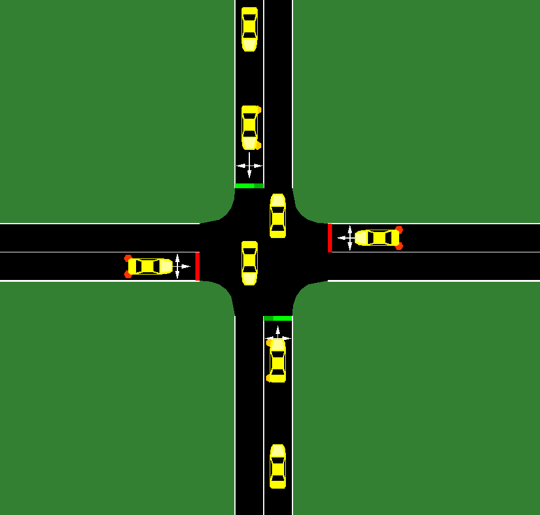

  <iframe width="560" height="315" src="https://www.youtube.com/embed/IBpHKF4D9oY" frameborder="0" allow="accelerometer; autoplay; clipboard-write; encrypted-media; gyroscope; picture-in-picture" allowfullscreen></iframe>

## Project Summary
**TrafficIQ** is an intelligent traffic light system designed to minimize car idle times at intersections and reduce traffic congestion. The system takes in the number of halted vehicles, average vehicle length, and cumulative waiting time for each of the four approach lanes (North, South, East, West), along with the current traffic light phase and simulation time. Given this information, it decides whether to keep or switch the active green direction (North/South vs. East/West).

## Approach
TASK:

Give a detailed description of your approach, in a few of paragraphs (at least a couple). You should summarize the main method you are using, such as by overviewing the structure of its data, how it samples that data, and the equations of the loss(es) it optimizes (you can copy this information from scientific publications or online resources, in which case cite them clearly. The default GitHub Pages we previously shared includes an example of redering math within Markdown). You should also provide details about the approach as it applies to your scenario, such as how you set up inputs and outputs (e.g. states / observations, actions, and rewards), how much data you use (e.g. for how many interaction steps you train), and the values of any hyperparameters (cite your source for default hyperparameter values, and for any changed values detail if and how you tune them and the numbers you end up using). A good guideline is to incorporate sufficient details so that most of your approach is reproducible by a reader. You’re encouraged to use figures and tables for this, as appropriate, e.g. as we used in the exercises.

RESPONSE:

TrafficIQ utilizes Proximal Policy Optimization (PPO) as its core learning algorithm, built on top of an Actor-Critic network architecture. This traffic light control system, currently, operates in the context of a single 4-way intersection.

The simulation environment is provided by SUMO (Simulation of Urban MObility), an open-source traffic simulator. The environment models a 4-way intersection with bidirectional travel on all lanes. At every timestep, the following features are recorded per lane: total halting vehicle count, mean vehicle length, and cumulative vehicle waiting time. A vehicle is considered halting if its speed falls below 0.1 m/s. Mean vehicle length is the average length of all vehicles currently present in the lane. Cumulative waiting time is the sum of accumulated wait times across all vehicles in a given lane. In addition to these per-lane features, two global values are shared across all lanes: current traffic light phase and current simulation time. Current phase reports the active signal state of the intersection, and simulation time tracks the total elapsed time of the simulation run. Together, these 14 values (4 lanes × 3 features + 2 global) form the state vector passed to the agent at each decision step.

The 14-dimensional state vector is fed into an Actor-Critic neural network consisting of two shared hidden layers followed by two separate output heads. The shared layers are fully connected, each with 64 neurons, and use a Tanh activation function. Tanh is preferred here over alternatives such as ReLU because it is zero-centered and bounded between (-1, 1), producing smoother, more stable gradients, a meaningful advantage when the critic must estimate values that may be positive or negative (in our case strictly negative). These shared layers act as a common feature extractor, allowing both the actor and critic to learn from the same intermediate representation rather than maintaining entirely separate networks, which encourages complementary learning between the two heads.

The actor head is a single linear layer mapping from 64 neurons to 2 outputs: one logit per possible action. These logits are passed to a Categorical distribution, which converts them into action probabilities internally. The critic head is similarly a single linear layer, mapping from 64 neurons to a single scalar output representing V(s): the estimated expected discounted return from the current state.

**EXPAND FURTHER DETAILS OVER DISCOUNTED EQUATION & LOSS OVERVIEW**

## Evaluation
An important aspect of your project, as we mentioned in the beginning, is evaluating your project. Be clear and precise about describing the evaluation setup, for both quantitative and qualitative results. Present the results to convince the reader that you have a working implementation. Use plots, charts, tables, screenshots, figures, etc. as appropriate. For each type of evaluation that you perform, you’ll probably need at least 1 or 2 paragraphs (excluding figures etc.) to describe it.

**CURENTLY** 
To evaluate model peformance, we utalize a simple % difference between
- algorithmic comparison
    -  very basic,
- graph to view % diff between simple alg 
    - doesn't improve too much
- future consideration
    - more advance alg comparison    

## Remaining Goals and Challenge

In a couple of paragraphs, describe your goals for the remainder of the quarter. At the very least, describe in what ways your current prototype is more limited than your final goal, and what you want to add to make it a complete contribution. Note that if you think your method is working well enough, but have not performed sufficient evaluation to gain insight, doing this should be a goal. Similarly, you may propose comparing with other methods / approaches / manually tailored solutions (when feasible) that you did not get a chance to implement, but can enrich your discussion in the final report. Finally, given your experience so far, describe some of the challenges you anticipate facing by the time your final report is due, to what degree you expect them to become road blocking obstacles, andwhat you might try in order to overcome them.

## Resources Used
Mention all the resources that you found useful in implementing your method, experiments, and analysis. This should include everything like code documentation, AI/ML libraries, source code that you used, StackOverflow, etc. You do not have to include every tiny (or commonplace) thing you used, but it is important to report the sources that are crucial to your project. One aspect that does need to be comprehensive is a description of any use you made of AI tools

We utilized <a href="https://sumo.dlr.de/docs/index.html">SUMO documentation</a> to aid initial setup of our intersection enviornment as well as for our light system interface. In addition 

- ADD GITHUB LINK FOR OTHER SUMO PROJ